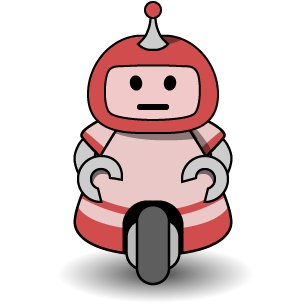
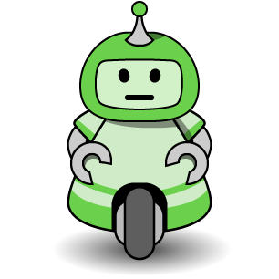
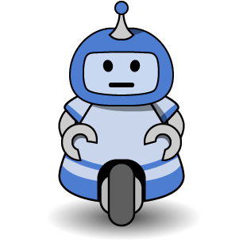
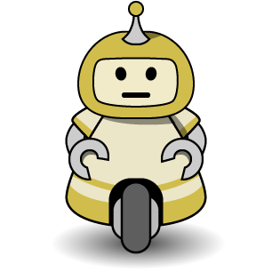
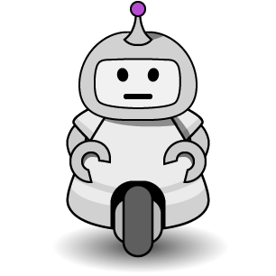

# :robot: Rickety Robots Client :robot:
A browser-based Ricochet Robots client written in Elm, to be paired with a backend written in Elixir. Includes chat, scorekeeping, and democratically-driven game management!

<p align="center"></p>

## Frontend Model (not finalized, documentation WIP)
  * **keys** : `Keys`. List of booleans representing active keyboard input
  * **user** : `User`. Information about the current user.
  * **users** : `List` of `User`s. Information about all users, including scores.
  * **chat** : `List` of `Chatline`s. A list of lines of text/usernames.
  * **messageInProgress** : `String`. Current chat input text.
  * **nameInProgress** : `String`. Current name-change input text.
  * **colorInProgress** : `String`. Current color-change input selection.
  * **boundaryBoard** : `Grid` of `Int`s. 16-by-16 array of arrays of integers, where the value determines how to print the board.
  * **goal** : `GoalSymbol`. Active goal symbol.
  * **goalList** : `List` of `Goal`s. List of all goals, including their symbols and positions.
  * **toggleStates** : `{`settings: `String`, activePoll: `String`, pollOptions: `String`, emoticons: `String`, countdown: `String}`. States for all toggle-able UI elements.
  * **countdown** : `Int`. 60s countdown timer that begins when one solution has been found.
  * **currentTimer** : `Int`. Count-up timer that restarts for each puzzle.
  * **robots** : `List` of `Robot`s. List of robots including color (ID), position, and legal (unblocked) moves.
  * **activeRobot** : `Maybe Robot`. Current selected robot for UI purposes.
  * **movesQueue** : `List` of `Move`s. Current stack of moves.

## JSON Codes

### Backend -> Frontend
"action" | "content" | Description
-------- | --------- | -----------
`connect_to_server` | | Server has connected. Respond with a request to create a user.
Tick| | Not implemented, so timers are not currently synchronized between frontend and backend.
`update_board`| | Reset `board` layout with a boundaryBoard sent from the server.
`update_robots`| | Update `robots` positions and sets of legal moves
`update_goals`| | Reset `goalList` positions and set the active goal
`switch_to_countdown`| | Switch clock mode to countdown (e.g. solution found)
`switch_to_timer`| | Switch clock mode to timer (e.g. new game)
`clear_moves_queue`| | Force `movesQueue` to clear, e.g. upon a new game.
`update_scoreboard`| | Update `users` names, colors, scores and all (for example, after each round is scored).
`update_user`| | Update current `user` name, color, etc.
`update_chat`| | Update `chat`
  
### Frontend -> Backend
"action" | "content" | Description
-------- | --------- | -----------
`submit_movelist` | `[ {"color": "Color", "direction": "Direction"} ]`| Submit list of moves
`create_user` | `""` | Add user
`update_user` | `{"username": "User", "color": "#faefa0", "score": 5, "is_admin": true, "is_muted": false}` | Update user
`update_chat` | `{"user": <User>, "msg": "Hello!", "kind": 0}` | Send (user) message
`new_game` | `""` | Immediately initialize a new game (only available to admin users).
`ping` | `"ping"` | Send "ping" every 50 seconds to maintain the connection.


## Keyboard Shortcuts
<kbd>1</kbd> or <kbd>R</kbd> : Select red robot

<kbd>2</kbd> or <kbd>G</kbd> : Select green robot

<kbd>3</kbd> or <kbd>B</kbd> : Select blue robot

<kbd>4</kbd> or <kbd>Y</kbd> : Select yellow robot

<kbd>5</kbd> or <kbd>S</kbd> : Select silver robot

<kbd>←</kbd>, <kbd>↑</kbd>, <kbd>→</kbd>, or <kbd>↓</kbd> : Attempt to queue a move for the selected robot in the corresponding direction.

<kbd>Esc</kbd> : Clear queue of moves

<kbd>Backspace</kbd> : Remove (undo) last move from queue

## Polls and Settings
Administration is performed through the use of `/poll <option> [param1, param2]` and `/set <option> [param1, param2]` commands entered through chat. A poll must succeed with more Yes votes than No votes to change settings. Only an **owner** can unilaterally change settings with `/set`. Available option/parameters:

 * `owner <UID>` : Grant owner status to user
 * `demote <UID>` : Remove owner status from user
 * `mute <UID>` : Set mute status for user (no chat or polls)
 * `unmute <UID>` : Remove mute status from user
 * `kick <UID>` : Kick user from game.
 * `set_score <UID> <# points>` : Set score of user to integer value.
 * `reset_scores` : Immediately reset all scores to 0.
 * `reset_board` : Immediately reset board, robots, and goal.
 * `new_game` : Immediately choose new goal.
 * `poll_time <# sec>` : Time before poll expires. Default is 120 seconds. Minimum is 30 seconds.
 * `countdown_time <# sec>` : Time to find better solutions. Default is 60 seconds.
 * `puzzles_before_new_board <# puzzles>` : Number of puzzles before a new board is generated. Default is 10.
 * `min_moves <# moves>` : A single-robot solution below this number will not increment the scoreboard. Default is 0.


## Build
Compile javascript from root directory: ```elm make ./src/Robots.elm --output=./assets/js/main.js```

Start project server at `http://localhost:8000` with ```elm reactor```. Navigate to `http://localhost:8000/Robots.html` to see the project.